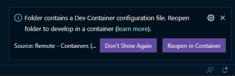

# devcontainer-base
Development container with common tools for web development with JavaScript and PHP.

## Requirements
- [Docker](https://docs.docker.com/get-docker/)
- [Visual Studio Code](https://code.visualstudio.com/)
- [Remote Containers extension](https://code.visualstudio.com/docs/remote/containers)

## Setup
1. Copy the `.devcontainer` folder to your project;
2. Open the project with VSCode;
3. Click on "Reopen in Container" when it pop ups on the bottom right;

4. Wait for the container to be built;
5. Done!

## Comes with
- Docker
- Docker Compose
- PHP
- Composer
- NodeJS & NPM
- Oh My Zsh
- Fzf
